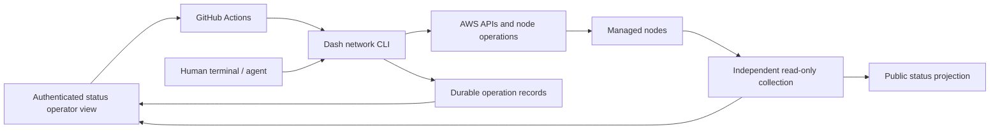

# Architecture

## One operational engine

The standalone Go executable is the shared engine for operators, Actions, and
agents. Network definitions are domain-specific input, not a general-purpose
infrastructure language. The old deployment repository is reference material,
not a backend. Initially support AWS, devnets, and explicitly managed testnet
resources.

Boxes denote responsibilities, not a requirement for separate microservices.
The current code implements intent, artifact resolution, plan previews, read-only
EC2 inventory, and a public projection, plus EC2 provisioning and authenticated
host bootstrap.
That stage uses explicit existing networking, owner-pinned AMIs, a DynamoDB journal
and non-expiring runner claims, and per-target launch reconciliation. The additive
bootstrap stage shares that
claim and journal, verifies SSH/instance identity, and prepares runtime/images
without starting containers. Chain lifecycle and scoped image-upgrade executors
are implemented; UI integration and web authentication remain future work.
See [provisioning and recovery](provisioning.md) for the exact boundary.

## Three kinds of state

- **Desired:** network identity/generation, topology, selected component versions.
- **Operation:** what was requested, executed, and verified on each target.
- **Observed:** what nodes, APIs, and cloud resources actually report, with timestamps.

A successful workflow does not imply permanent network health. Unreachable and
stale targets remain unknown. EC2 availability alone does not prove Core sync,
registration, Platform consensus, or a functioning DAPI request.

Network/node/generation identifiers scope all future observations and operations.
Names such as `hp-masternode-1` are not globally unique. A reset must not reuse the
previous generation's high block height or proposer state.

## Compatibility is ours to discover

No new upstream release contract is assumed. The target resolver will prefer
requested channels, stable Core, and available dependency hints in the matching
Platform/Dashmate source, with explicit version/channel overrides. It will test
the combinations we intend to use, not all possible permutations.

Today the operator declares image candidates and the registry resolver verifies
their architecture-specific artifacts. `artifacts-verified` is deliberately not
called `compatible`. Future evidence can distinguish config checks, fresh-network
boot, and existing-state upgrade verification.

Use moving tags only during resolution. Save immutable artifact references for
all hosts. Retrying an operation must not silently resolve a newer nightly.
Automatic downgrade of migrated persistent state is not a general rollback.

## Public showcase and operator console

The public product should provide shareable network pages, real versions/progress,
availability history when measured, and public developer endpoints. Private
networks can remain wholly unlisted. Public data comes from an explicit projection,
not operator JSON with hidden UI fields. Unknown/degraded states remain honest.

Authenticated operators get permitted private networks, inventories, diagnostic
detail, version drift, costs, expiry, operation history, and bounded controls.
Login proves identity, not administrative authority. Network/action authorization
must be enforced server-side. GitHub dispatch uses a narrowly scoped server-side
App, never a browser-held cloud credential or unrestricted token.

The current status repository can retain its React interface and useful monitoring
views while replacing single-network inventory/name-keyed state. Existing
unmerged/live status adaptations must be inspected and preserved before changing
its implementation.

## Existing Moutai and managed testnet

The [existing-state path](managed-networks.md) imports explicit AWS/container
bindings, enrolls them without recreation, and operates their captured workloads
through the same CLI/Actions execution model. Public observation stays read-only;
both networks are intended to have authenticated deploy/upgrade/recovery controls.
It does not infer a fresh devnet genesis for testnet, regenerate operator keys or
silently reset databases. Existing-state deployment/restoration is implemented;
provisioning additional testnet nodes remains separate work.

## Execution boundaries

The EC2 stage implements ownership/scope checks, shared exclusion, and durable
per-target progress. Its journal is one immutable create operation per network,
not yet a full lifecycle/event-history store. A launch with an uncertain outcome
is reconciled, never blindly resubmitted. Shared state does not magically fence
in-flight EC2 API calls; forced claim release requires a stopped runner.

Verified SSH now uses explicit instance-scoped known_hosts trust and a local
identity, with a second IMDSv2 identity check. The bootstrap recipe is hashed into
the plan, rejects existing containers, and uses host-side flock plus fresh probes
for interruption recovery. See [bootstrap](bootstrap.md) for its precise limits.
The chain executor persists signed transactions before broadcast and reconciles
registration retries. The [live acceptance run](validation-2026-09-24.md) verified
interrupted registration and full stop/resume without replacing identities.
No arbitrary shell input comes from a UI.

Platform-only operations must verify unchanged Core identity/process/configuration
as well as Platform readiness. Rollout batches must reflect actual quorum and
upgrade compatibility; independent fast restarts are not a universal strategy.
The [upgrade executor](upgrades.md) stores current images separately from creation
intent, stages exact artifacts, journals each withdrawal before SSH, and requires
whole-fleet health/preservation before moving to the next validator. Unknown
runtime journal fields fence older executors; migrated databases are never
automatically downgraded.

Actions should use short-lived AWS OIDC credentials restricted to trusted
repository/ref/environment and intended resource scope. GitHub concurrency alone
cannot serialize a separate terminal invocation. A vanished/cancelled runner
leaves an interrupted operation requiring reconciliation, not an implied rollback.

## Emergency independence

The executable must remain useful without the dashboard, GitHub, or an AI session.
Keep tested binaries, exact artifacts, network definitions, access instructions,
and recovery evidence available outside the system being recovered. Normal cloud
provisioning still requires cloud APIs. Rehearse a human recovery from a clean
machine as an acceptance test, rather than relying only on documentation.
